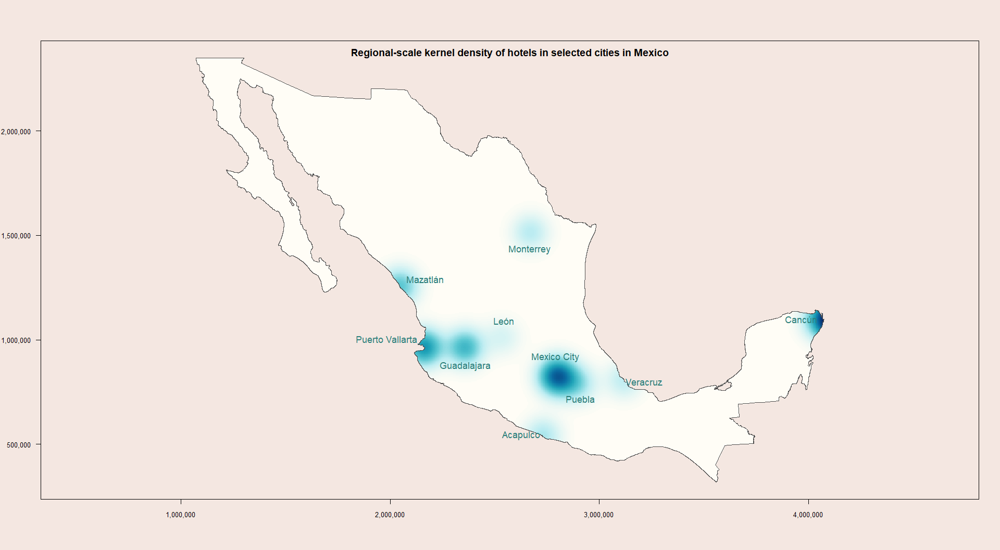

# Intercity Mobility & Hotel Geolocation — Web Scraping System

Automated data extraction system for intercity bus travel and hotel geolocation in Mexico. The system collects route information (schedules, fares, terminals) from four bus platforms and georeferenced hotel coordinates.

Developed as part of a research project at **UNAM - IIEc** (Instituto de Investigaciones Económicas).

## Overview

The system consists of five independent Python scripts, one per platform:

| Script | Platform | Data collected |
|---|---|---|
| `ado_scraper.py` | [ADO](https://www.ado.com.mx/) | Bus routes: south, southeast & Gulf of Mexico |
| `omnibus_scraper.py` | [Omnibus de México](https://www.omnibus.com.mx/) | Bus routes: north, Bajío & central Mexico |
| `clickbus_scraper.py` | [ClickBus](https://www.clickbus.com.mx/) | Bus routes: multi-carrier aggregator |
| `busbud_scraper.py` | [BusBud](https://www.busbud.com/) | Bus routes: multi-carrier aggregator |
| `booking_scraper.py` | [Booking](https://www.booking.com/) | Hotel coordinates |

Each script can be executed independently, in any order, and at any time.

## Requirements

- **Python 3.10** (see `.python-version`)
- **Google Chrome** installed on your system (Selenium automates a real browser instance; it does not emulate one)
- ChromeDriver is managed automatically by `webdriver-manager` at runtime

## Installation

### Option A: venv (recommended)

```bash
# Clone the repository
git clone https://github.com/<username>/movilidadForanea.git
cd movilidadForanea

# Create virtual environment with Python 3.10
python3.10 -m venv venv

# Activate the environment
# Linux / macOS:
source venv/bin/activate
# Windows:
venv\Scripts\activate

# Install dependencies
pip install -r requirements.txt
```

### Option B: uv (alternative)

```bash
# Clone the repository
git clone https://github.com/<username>/movilidadForanea.git
cd movilidadForanea

# Create virtual environment (uv downloads Python 3.10 automatically if needed)
uv venv venv --python=python3.10

# Activate the environment
# Linux / macOS:
source venv/bin/activate
# Windows:
venv\Scripts\activate

# Install dependencies
uv pip install -r requirements.txt
```

> **Note:** On Windows and Debian-based distributions, `uv` may require manual installation of `setuptools` and `wheel` before installing the project dependencies:
> ```bash
> uv pip install setuptools wheel
> uv pip install -r requirements.txt
> ```

## Configuration

Before running any script, set the output directory by editing the `path_out` variable at the top of each script file:

```python
path_out = "/your/desired/output/path/"
```

The output directory must exist before execution — the scripts do not create it automatically. The `output/` folder in this repository is provided for this purpose.

### Customizing cities and dates

Each script defines its own list of cities and date range internally:

- **Cities:** Edit the `define_routes()` method to modify the list of origin-destination cities. Note that city names differ across platforms for the same location (e.g., "Ciudad de México, CDMX" in ADO vs. "Ciudad de Mexico, México, México" in BusBud).
- **Dates:** Edit the `define_dates()` method to adjust the date range. Mobility scripts generate consecutive dates starting from the execution day. The Booking script uses a single check-in date with a fixed 5-day stay.

## Usage

Activate the virtual environment and run any script from the terminal:

```bash
# Activate environment
source venv/bin/activate  # Linux/macOS
venv\Scripts\activate     # Windows

# Run a scraper
python scripts/ado_scraper.py
python scripts/busbud_scraper.py
python scripts/clickbus_scraper.py
python scripts/omnibus_scraper.py
python scripts/booking_scraper.py
```

Scripts run in **visible (non-headless) mode** — a Chrome window will open and you can observe the extraction process in real time. Each script generates individual `.xlsx` files per query and a consolidated file per platform upon completion.

## Output

The `output/` directory serves as the primary destination for all raw data extracted by the Python web scraping scripts. It acts as the intermediate staging area before the data is moved to the `post-processing/` directory for cleaning and spatial analysis.

## Error Logging

Each script generates a `.log` file in the output directory with warnings and errors (failed selectors, captured exceptions, export errors). Progress messages are printed to the console during execution.

## Post-processing (R script and final data)

### Mobility Data Processing (`interurban_mobility_flows.R`)
This script integrates the output from the four bus platforms (ADO, BusBud, ClickBus, Omnibus) into a single dataset. Key tasks include:

* **Data Cleansing & Standardization:** Filters out unnecessary variables, standardizes dates, and groups dozens of specific bus terminals into standardized city keys (e.g., "aca", "mex", "gdl").
* **Origin-Destination (OD) Matrix:** Aggregates the cleaned data to create a frequency table of trips between origin and destination cities.
* **Spatial Mapping:** Merges the OD matrix with geographical coordinates (`ciudades.csv`) to build spatial line geometries (`sf`). It outputs a map (`flow_cities.jpg`) illustrating interurban travel flows, where line thickness represents the volume of available trips.

### 2. Hotel Data Processing (`hotel_kernel_analysis.R`)
This script processes the georeferenced accommodation data extracted from Booking. Key tasks include:

* **Data Cleansing:** Standardizes city names to match the mobility city keys and formats text data.
* **Kernel Density Estimation (KDE):** Converts coordinates into spatial point patterns (`spatstat`) to calculate the concentration of hotels.
* **Spatial Mapping:** Generates two maps cropped to the Mexican national boundary:
    * `local_kernel.jpg`: Highlights dense, city-level accommodation clusters (sigma = 30km).
    * `regional_kernel.jpg`: Highlights broader spatial corridors and regional accommodation trends (sigma = 60km).

### Generated Maps
Here is an example of the visual outputs generated by the post-processing scripts:

**Interurban Travel Flows**
*(This map visualizes the spatial concentration of hotels across selected Mexican cities using a Kernel Density Estimation (KDE)).*



> **Note:** To view the hotel density maps, navigate to `post-processing/hotels/local_kernel.jpg` or `regional_kernel.jpg`.

## Important Notes

- Python scripts include systematic wait times between requests to avoid overloading the consulted servers.
- The extraction system depends on the HTML structure of each platform. Interface changes (CSS selectors, element attributes, calendar components) may require updating the scripts.
- City naming conventions differ across platforms and must be verified manually when configuring a new set of cities.
- Google Chrome must be installed independently — it is not part of the Python environment.
- The post-processing is an additional step after the city and hotel extractions.  

## License

This project is licensed under the GNU General Public License v3.0 — see the LICENSE file for the full text.

## Author

- Ivan Espinosa Ramírez - UNAM, Instituto de Investigaciones Economicas (IIEc) 
- Victor Alfonso Reyes García - UNAM, Instituto de Investigaciones Economicas (IIEc)
